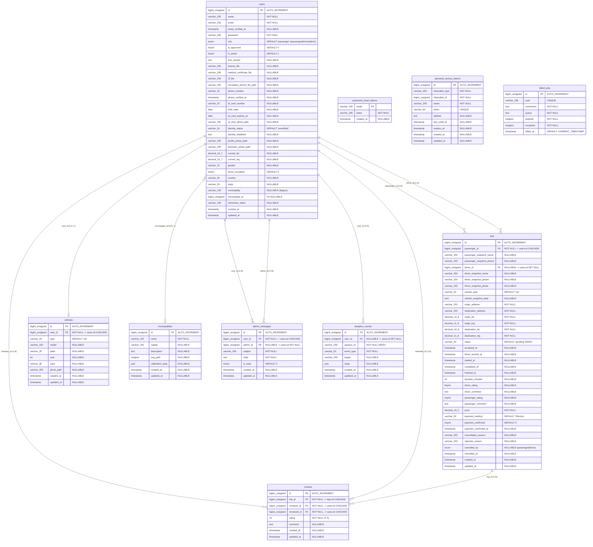

# CAPÍTULO IV — DESARROLLO DE LA PROPUESTA TECNOLÓGICA

## Sistema de Información Web para la Gestión Integral de Movilidad Urbana: Vecta Mobility

---

## 4.1 Marco de la Propuesta

### 4.1.1 Objetivo General de la Propuesta

Diseñar, desarrollar e implantar un sistema de información web para la gestión integral de movilidad urbana en los Valles del Tuy, estado Miranda, fundamentado en una arquitectura monolítica modular con **Laravel 10**, **Inertia.js** y **Vue 3**, que permita la solicitud, asignación, seguimiento en tiempo real y calificación de servicios de transporte, incorporando mecanismos de verificación de identidad biométrica y documental, cálculo dinámico de tarifas y analíticas operacionales para la toma de decisiones gerenciales, con el fin de optimizar los tiempos de respuesta del servicio de transporte y garantizar la seguridad de los actores involucrados.

### 4.1.2 Objetivos Específicos de la Propuesta

1. **Analizar** los procesos operativos del servicio de transporte urbano en los Valles del Tuy mediante técnicas de levantamiento de información (observación directa, entrevistas y cuestionarios), a fin de identificar los requerimientos funcionales y no funcionales del sistema propuesto.

2. **Diseñar** la arquitectura del sistema aplicando principios de ingeniería del software (SOLID, MVC, Repository Pattern), modelando la base de datos relacional con técnicas de normalización hasta la tercera forma normal (3FN) y desnormalización controlada mediante *snapshots* transaccionales, y especificando la interacción entre componentes mediante diagramas de flujo de datos (DFD) y cartas estructuradas.

3. **Desarrollar** los módulos del sistema —Autenticación y Registro Multirol, Gestión de Viajes con geolocalización GPS, Verificación Documental y Biométrica, Sistema de Calificaciones Cruzadas y Dashboard de Analíticas— utilizando metodologías ágiles (Scrum adaptado) y el stack tecnológico **Laravel 10 + Inertia.js + Vue 3 + Tailwind CSS + MySQL**.

4. **Implantar y validar** el sistema en un entorno de producción contenerizado con **Docker** y **Dokploy**, ejecutando pruebas funcionales, pruebas de integración y pruebas de aceptación de usuario para verificar el cumplimiento de los requerimientos especificados y la estabilidad operacional del sistema desplegado.

### 4.1.3 Justificación de la Propuesta

#### Desde el Punto de Vista Técnico

La propuesta se sustenta en una arquitectura **monolítica modular** que combina la robustez del framework **Laravel 10** (PHP 8.1) como motor de backend con la reactividad del framework **Vue 3** (Composition API) como capa de presentación, vinculados mediante el protocolo **Inertia.js** que elimina la necesidad de construir una API REST separada. Esta decisión arquitectónica reduce la complejidad del despliegue y la latencia de comunicación entre capas, manteniendo al mismo tiempo una separación clara de responsabilidades a través del patrón **Model-View-Controller (MVC)**.

La modularización del frontend en componentes especializados por rol —`AdminDashboard.vue`, `DriverDashboard.vue` y `PassengerDashboard.vue`— garantiza la mantenibilidad del código al aislar la lógica de presentación de cada actor del sistema. En el backend, la extracción de la lógica de cálculo de tarifas al servicio dedicado `PricingService.php` aplica el principio de **Responsabilidad Única (SRP)** de los principios SOLID, permitiendo la evolución independiente del algoritmo de pricing sin afectar los controladores.

La contenerización mediante **Docker** y el despliegue automatizado con **Dokploy** aseguran la reproducibilidad del entorno en cualquier servidor VPS, eliminando la problemática clásica de dependencias de sistema operativo.

#### Desde el Punto de Vista Operativo

El sistema aborda una necesidad crítica de seguridad al implementar un flujo de verificación documental de cinco (5) documentos obligatorios para conductores (fotografía de perfil, licencia de conducir, cédula de identidad, certificado médico, RIF y permiso de circulación), complementado con captura biométrica facial en tiempo real mediante la API `getUserMedia` del navegador. Este mecanismo mitiga significativamente el riesgo de suplantación de identidad, problema recurrente en los servicios de transporte informales de la región.

Los dashboards modulares están diseñados con principios de usabilidad centrada en el usuario, ofreciendo interfaces diferenciadas que minimizan la curva de aprendizaje para cada rol: el pasajero accede a un flujo simplificado de solicitud de viaje con mapa interactivo; el conductor visualiza un panel operativo con viajes disponibles y gestión de estados; el administrador dispone de un centro de control con estadísticas en tiempo real, mapas de calor de actividad y gráficos analíticos.

#### Desde el Punto de Vista Social y Económico

La plataforma contribuye a la formalización del servicio de transporte urbano en los Valles del Tuy, una región donde el transporte informal carece de mecanismos de trazabilidad, seguridad y rendición de cuentas. Al integrar un sistema de calificaciones cruzadas (conductor ↔ pasajero), se promueve la autorregulación de la calidad del servicio.

Económicamente, el modelo de negocio implementado contempla una comisión del 10% sobre el valor de cada viaje (`APP_FEE_PERCENTAGE = 0.10`), generando un flujo de ingresos sostenible que financia la operación de la plataforma sin incrementar significativamente el costo para el usuario final. El cálculo dinámico de tarifas basado en distancia geodésica (fórmula de Haversine) y tiempo estimado, con tarifas diferenciadas por tipo de vehículo (automóvil vs. motocicleta), asegura transparencia y equidad en la fijación de precios.

---

## 4.2 Estudio de Factibilidad

### 4.2.1 Factibilidad Técnica

La evaluación de la factibilidad técnica comprende el análisis de los recursos de hardware, software y servicios requeridos para el desarrollo, pruebas y despliegue del sistema.

#### Recursos de Hardware (Desarrollo)

| Componente | Especificación Mínima | Especificación Utilizada |
|---|---|---|
| Procesador | Intel Core i5 (8.ª gen.) o equivalente | AMD Ryzen 5 / Intel Core i7 |
| Memoria RAM | 8 GB DDR4 | 16 GB DDR4 |
| Almacenamiento | 256 GB SSD | 512 GB NVMe SSD |
| Conectividad | Ethernet / Wi-Fi 5 | Wi-Fi 6 / Ethernet Gigabit |

#### Recursos de Hardware (Producción — VPS)

| Componente | Especificación |
|---|---|
| vCPUs | 2 núcleos |
| Memoria RAM | 4 GB |
| Almacenamiento | 80 GB SSD |
| Ancho de banda | 4 TB/mes |
| Sistema Operativo | Ubuntu Server 22.04 LTS |

#### Recursos de Software

| Software | Versión | Propósito |
|---|---|---|
| PHP | 8.1+ | Runtime del backend Laravel |
| Composer | 2.x | Gestión de dependencias PHP |
| Node.js | 18+ | Compilación de assets frontend (Vite) |
| npm | 9+ | Gestión de paquetes JavaScript |
| MySQL | 8.0 | Motor de base de datos relacional |
| Docker | 24+ | Contenerización de servicios |
| Docker Compose | 2.x | Orquestación de contenedores |
| Dokploy | Última estable | Plataforma de despliegue automatizado |
| Git | 2.x | Control de versiones |
| Laravel | 10.x | Framework backend PHP (MVC) |
| Vue.js | 3.x | Framework frontend reactivo |
| Inertia.js | 1.x | Protocolo de comunicación SPA monolítica |
| Tailwind CSS | 3.x | Framework de utilidades CSS |
| Vite | 4.x | Empaquetador de módulos frontend |
| Pusher / Laravel Echo | 8.x / 2.x | WebSockets para eventos en tiempo real |
| Ziggy | Última | Generación de rutas Laravel en JavaScript |

#### Servicios Externos

| Servicio | Propósito |
|---|---|
| DolarAPI (ve.dolarapi.com) | Consulta de tasa de cambio BCV oficial (Bs./USD) |
| Pusher Channels | Infraestructura de WebSockets para geolocalización en vivo |
| Leaflet.js + OpenStreetMap | Renderizado de mapas interactivos y mapas de calor |
| GitHub | Repositorio de código fuente y control de versiones |

**Conclusión de Factibilidad Técnica:** El equipo de desarrollo dispone de los recursos de hardware, software y conectividad necesarios para la construcción del sistema. Las tecnologías seleccionadas son de código abierto (excepto Pusher en su capa gratuita), lo que elimina costos de licenciamiento. El despliegue contenerizado con Docker garantiza la portabilidad entre entornos de desarrollo y producción.

### 4.2.2 Factibilidad Operativa

El análisis de la factibilidad operativa evalúa la capacidad de los usuarios finales para operar el sistema y la disposición organizacional para adoptarlo.

#### Análisis por Rol de Usuario

| Rol | Perfil del Usuario | Curva de Aprendizaje | Capacitación Requerida |
|---|---|---|---|
| **Pasajero** | Público general con smartphone y navegador web | **Baja** — Interfaz intuitiva similar a apps de movilidad conocidas (Uber, inDrive) | Mínima: tutorial visual integrado en la pantalla Welcome |
| **Conductor** | Conductores con licencia y documentación vigente | **Media** — Requiere familiarización con la carga de documentos y el flujo de aceptación/gestión de viajes | Guía de usuario con capturas paso a paso del proceso de registro y verificación documental |
| **Administrador** | Personal técnico-administrativo de la plataforma | **Media-Alta** — Manejo de verificaciones, analíticas, sanciones y mensajería interna | Sesión de inducción presencial o virtual (2 horas) + manual de administración |

#### Factores de Aceptación

- **Diseño responsivo:** La interfaz con Tailwind CSS se adapta a dispositivos móviles, tablets y desktops.
- **Flujo de verificación progresivo:** El conductor no necesita completar todos los documentos en una sola sesión; puede guardar parcialmente y continuar después.
- **Feedback inmediato:** El sistema proporciona notificaciones visuales (`flash messages`) en cada acción del usuario, reduciendo la incertidumbre operativa.
- **Dashboards modulares:** Cada rol accede únicamente a la información y acciones relevantes a su función, evitando sobrecarga cognitiva.

**Conclusión de Factibilidad Operativa:** El sistema es operativamente viable dado que los flujos de usuario están diseñados siguiendo patrones de interacción familiares para usuarios de aplicaciones de movilidad. La modularización por rol minimiza la complejidad percibida y la capacitación requerida se limita a guías visuales y una sesión de inducción para administradores.

### 4.2.3 Factibilidad Económica

#### Tabla de Costos de Desarrollo e Infraestructura

| Concepto | Cantidad | Costo Unitario (USD) | Costo Total (USD) |
|---|---|---|---|
| **Recurso Humano** | | | |
| Desarrollador Fullstack Senior | 480 horas | $15.00/hora | $7,200.00 |
| Diseñador UI/UX (apoyo) | 40 horas | $12.00/hora | $480.00 |
| **Infraestructura** | | | |
| VPS (Producción) | 12 meses | $24.00/mes | $288.00 |
| Dominio (.com) | 1 año | $12.00/año | $12.00 |
| Certificado SSL (Let's Encrypt) | 1 año | $0.00 | $0.00 |
| **Servicios Externos** | | | |
| Pusher Channels (Plan Free) | 12 meses | $0.00 | $0.00 |
| GitHub (Plan Free) | 12 meses | $0.00 | $0.00 |
| DolarAPI (Pública) | 12 meses | $0.00 | $0.00 |
| **Software** | | | |
| Laravel, Vue.js, Docker (Open Source) | — | $0.00 | $0.00 |
| **Capacitación** | | | |
| Sesiones de inducción (Admin) | 2 sesiones | $50.00 | $100.00 |
| Elaboración de manuales | 1 paquete | $150.00 | $150.00 |
| | | **TOTAL** | **$8,230.00** |

#### Análisis Costo-Beneficio

**Beneficios tangibles:**
- Reducción estimada del 40% en tiempos de espera del pasajero al automatizar la asignación de viajes.
- Eliminación de intermediarios telefónicos, reduciendo costos operativos de despacho.
- Generación de ingresos por comisión del 10% sobre el GMV (Gross Merchandise Value) de cada viaje completado.

**Beneficios intangibles:**
- Mejora en la percepción de seguridad mediante la trazabilidad digital de cada viaje.
- Formalización del servicio de transporte con documentación verificable.
- Acceso a datos analíticos para la toma de decisiones estratégicas (zonas de mayor demanda, horarios pico, distribución de flota).

**Conclusión de Factibilidad Económica:** El costo total de desarrollo e implantación del sistema se estima en **$8,230.00 USD**, una inversión recuperable en el corto a mediano plazo mediante el modelo de comisión por transacción. El uso predominante de tecnologías de código abierto y servicios con capas gratuitas minimiza los costos recurrentes de operación.

---

## 4.3 Ingeniería del Software — Requerimientos

### 4.3.1 Requerimientos Funcionales

Los requerimientos funcionales se clasifican por módulos del sistema, siguiendo la estructura arquitectónica implementada en el código fuente.

#### Módulo 1: Autenticación y Registro

| ID | Requerimiento | Prioridad |
|---|---|---|
| RF-01 | El sistema debe permitir el registro de usuarios con nombre, correo electrónico, contraseña y selección de rol (Pasajero o Conductor). | Alta |
| RF-02 | El sistema debe permitir el inicio de sesión mediante correo electrónico y contraseña con validación de credenciales. | Alta |
| RF-03 | El sistema debe permitir la selección de municipio de residencia durante el registro, vinculando al usuario con la entidad geográfica correspondiente (`municipality_id`). | Media |
| RF-04 | El sistema debe redirigir automáticamente al usuario a su dashboard correspondiente según el rol asignado (Pasajero, Conductor o Administrador). | Alta |

#### Módulo 2: Gestión de Viajes

| ID | Requerimiento | Prioridad |
|---|---|---|
| RF-05 | El sistema debe permitir al pasajero solicitar un viaje especificando origen (dirección + coordenadas GPS), destino (dirección + coordenadas GPS), método de pago (Efectivo o Pago Móvil) y tipo de vehículo (Automóvil o Motocicleta). | Alta |
| RF-06 | El sistema debe calcular automáticamente el precio del viaje en el backend mediante la fórmula de Haversine para distancia geodésica, aplicando tarifas diferenciadas por tipo de vehículo (`PricingService`). | Alta |
| RF-07 | El sistema debe mostrar al conductor una lista de viajes disponibles (estado `pending`) filtrados por tipo de vehículo. | Alta |
| RF-08 | El sistema debe permitir al conductor aceptar un viaje disponible, cambiando su estado a `accepted` y registrando un *snapshot* congelado de los datos del conductor y su vehículo. | Alta |
| RF-09 | El sistema debe permitir al conductor iniciar un viaje aceptado (estado `in_progress`), registrando la marca temporal `started_at`. | Alta |
| RF-10 | El sistema debe permitir al conductor finalizar un viaje en curso (estado `completed`), calculando automáticamente la duración en minutos. | Alta |
| RF-11 | El sistema debe permitir al pasajero cancelar un viaje pendiente, eliminándolo de la base de datos. | Alta |
| RF-12 | El sistema debe permitir al conductor liberar un viaje aceptado (re-emparejamiento), devolviéndolo al estado `pending` para que otro conductor pueda tomarlo. | Media |
| RF-13 | El sistema debe permitir la cancelación con motivo tanto por el pasajero como por el conductor, registrando el motivo, el rol que cancela y la marca temporal. | Media |
| RF-14 | El sistema debe permitir al conductor rechazar un viaje disponible registrando el motivo como evento analítico (`driver_rejection`) sin alterar el estado del viaje. | Media |
| RF-15 | El sistema debe permitir al conductor confirmar la recepción del pago móvil, marcando el viaje como `payment_confirmed`. | Media |
| RF-16 | El sistema debe mostrar un historial de viajes completados y cancelados, diferenciado por rol (pasajero o conductor). | Media |

#### Módulo 3: Verificación Documental y de Identidad

| ID | Requerimiento | Prioridad |
|---|---|---|
| RF-17 | El sistema debe permitir al conductor cargar los siguientes documentos: fotografía de perfil, licencia de conducir, fotografía de cédula de identidad, certificado médico, RIF y permiso de circulación, almacenándolos en disco seguro (`secure`). | Alta |
| RF-18 | El sistema debe permitir al usuario cargar datos de identidad (número de cédula, fecha de nacimiento, fecha de vencimiento de cédula) y una fotografía biométrica capturada en tiempo real mediante la cámara del dispositivo. | Alta |
| RF-19 | El sistema debe cambiar automáticamente el estado de identidad a `pending` cuando el usuario complete la carga documental completa. | Alta |
| RF-20 | El sistema debe permitir al administrador aprobar o rechazar la identidad de un usuario, proporcionando retroalimentación textual en caso de rechazo. | Alta |
| RF-21 | El sistema debe bloquear la edición de documentos de identidad una vez que el estado sea `approved`. | Alta |

#### Módulo 4: Calificaciones y Reseñas

| ID | Requerimiento | Prioridad |
|---|---|---|
| RF-22 | El sistema debe permitir al pasajero y al conductor calificar mutuamente al finalizar un viaje, asignando de 1 a 5 estrellas y un comentario opcional, evitando duplicados mediante `updateOrCreate`. | Alta |
| RF-23 | El sistema debe calcular y mostrar dinámicamente el promedio de calificaciones (`average_rating`) y el total de calificaciones (`total_ratings`) de cada usuario mediante *accessors* de Eloquent. | Media |

#### Módulo 5: Administración y Analíticas

| ID | Requerimiento | Prioridad |
|---|---|---|
| RF-24 | El sistema debe proporcionar un dashboard administrativo con estadísticas en tiempo real: total de viajes, viajes completados/cancelados/activos, total de conductores/pasajeros, ingresos totales, tasa de completitud y verificaciones pendientes. | Alta |
| RF-25 | El sistema debe generar mapas de calor basados en las coordenadas GPS de orígenes, destinos y ubicaciones de conductores activos en los últimos 30 días. | Media |
| RF-26 | El sistema debe proporcionar un dashboard de analíticas avanzadas con gráficos de: tendencia de registros por día, distribución de conductores por municipio, métodos de pago, viajes por día de la semana, distribución de calificaciones, panorama de flota y desglose de cancelaciones/rechazos. | Media |
| RF-27 | El sistema debe permitir al administrador sancionar (desactivar) o reactivar usuarios, con registro del motivo de la sanción. | Alta |
| RF-28 | El sistema debe permitir al administrador enviar mensajes internos a usuarios específicos a través de un buzón administrativo. | Media |
| RF-29 | El sistema debe registrar eventos analíticos del frontend (page views, clicks, errores) en lotes para su posterior análisis. | Baja |

#### Módulo 6: Geolocalización y Tiempo Real

| ID | Requerimiento | Prioridad |
|---|---|---|
| RF-30 | El sistema debe permitir al conductor actualizar su ubicación GPS en tiempo real mediante una API REST protegida, almacenando las coordenadas (`current_lat`, `current_lng`) en la base de datos. | Alta |
| RF-31 | El sistema debe transmitir las actualizaciones de ubicación del conductor a los clientes conectados mediante WebSockets (Pusher/Echo) a través del evento `DriverLocationUpdated`. | Alta |
| RF-32 | El sistema debe mostrar un mapa interactivo en la página de bienvenida con la distribución de conductores aprobados por municipio, utilizando datos SVG calibrados. | Media |

#### Módulo 7: Conversión de Divisas

| ID | Requerimiento | Prioridad |
|---|---|---|
| RF-33 | El sistema debe consultar y cachear la tasa de cambio BCV oficial (Bs./USD) desde la API externa `ve.dolarapi.com`, actualizándola automáticamente en los cortes de las 9:00 AM y 5:00 PM (hora Venezuela). | Media |
| RF-34 | El sistema debe compartir la tasa BCV como prop global de Inertia, permitiendo a los componentes Vue mostrar equivalencias en bolívares. | Media |

### 4.3.2 Requerimientos No Funcionales

| ID | Categoría | Requerimiento |
|---|---|---|
| RNF-01 | **Rendimiento** | El tiempo de respuesta del servidor para las operaciones CRUD principales (solicitar viaje, aceptar viaje, cargar documento) no debe exceder los 2 segundos bajo condiciones normales de carga. |
| RNF-02 | **Rendimiento** | El sistema debe soportar al menos 100 usuarios concurrentes sin degradación perceptible del rendimiento. |
| RNF-03 | **Rendimiento** | La consulta a la API externa BCV debe contar con un timeout de 5 segundos y un mecanismo de caché que evite consultas redundantes. |
| RNF-04 | **Seguridad** | Todas las contraseñas deben almacenarse hasheadas mediante el algoritmo Bcrypt provisto por Laravel. |
| RNF-05 | **Seguridad** | Los documentos sensibles (licencia, cédula, certificado médico, RIF, permiso de circulación, fotografía biométrica) deben almacenarse en un disco no público (`secure`) y servirse a través de una ruta autenticada que valide la propiedad del archivo o el rol de administrador. |
| RNF-06 | **Seguridad** | Todas las rutas que realizan operaciones de escritura deben estar protegidas por el middleware `auth` de Laravel y validación CSRF. |
| RNF-07 | **Seguridad** | Los datos de entrada deben validarse tanto en el frontend (validación reactiva en Vue) como en el backend (validación de FormRequest o inline `$request->validate()`). |
| RNF-08 | **Escalabilidad** | La arquitectura monolítica modular debe permitir la extracción de módulos en microservicios independientes sin reescritura completa del sistema. |
| RNF-09 | **Disponibilidad** | El sistema debe mantener una disponibilidad mínima del 99% mensual, garantizada mediante la contenerización con Docker y el despliegue automatizado con Dokploy. |
| RNF-10 | **Compatibilidad** | La interfaz web debe ser compatible con los navegadores modernos: Google Chrome 90+, Mozilla Firefox 88+, Safari 14+ y Microsoft Edge 90+. |
| RNF-11 | **Compatibilidad** | La interfaz debe ser completamente responsiva, adaptándose a resoluciones desde 320px (móvil) hasta 1920px (desktop). |
| RNF-12 | **Mantenibilidad** | El código fuente debe seguir el estándar PSR-12 para PHP, Composition API con `<script setup>` para Vue, y Conventional Commits para el control de versiones. |
# CAPÍTULO IV — PARTE 2: Modelado del Sistema y Base de Datos

---

## 4.4 Modelado del Sistema

### 4.4.1 Diagrama de Flujo de Datos (DFD)

#### Nivel 0 — Diagrama de Contexto

El diagrama de contexto representa al sistema **Vecta Mobility** como un único proceso central que interactúa con tres entidades externas principales y dos fuentes de datos externas.

**Entidades Externas:**

| Entidad | Descripción |
|---|---|
| **Pasajero** | Usuario que solicita, paga y califica viajes |
| **Conductor** | Usuario que acepta, ejecuta y cobra viajes |
| **Administrador** | Usuario que gestiona verificaciones, sanciones y analíticas |

**Fuentes de Datos Externas:**

| Fuente | Descripción |
|---|---|
| **API DolarAPI (BCV)** | Proveedor de la tasa de cambio oficial Bs./USD |
| **Pusher Channels** | Infraestructura de WebSockets para eventos en tiempo real |

**Flujos de Datos — Nivel 0:**

```
PASAJERO ──────────────────────────────────────────────── SISTEMA VECTA
  ──→ Datos de registro (nombre, email, contraseña, municipio, rol)
  ──→ Solicitud de viaje (origen, destino, coordenadas, método pago, tipo vehículo)
  ──→ Cancelación de viaje (motivo)
  ──→ Calificación (estrellas, comentario)
  ──→ Datos de identidad (cédula, fecha nacimiento, foto biométrica)
  ←── Dashboard personalizado (viaje activo, historial, notificaciones)
  ←── Precio calculado del viaje
  ←── Estado del viaje en tiempo real

CONDUCTOR ─────────────────────────────────────────────── SISTEMA VECTA
  ──→ Datos de registro (nombre, email, contraseña, municipio, rol, vehículo)
  ──→ Documentos (licencia, certificado médico, RIF, permiso circulación)
  ──→ Aceptación / Rechazo de viaje
  ──→ Actualización de ubicación GPS (lat, lng)
  ──→ Confirmación de pago
  ──→ Calificación (estrellas, comentario)
  ←── Lista de viajes disponibles
  ←── Dashboard operativo (mis viajes, estado aprobación)

ADMINISTRADOR ─────────────────────────────────────────── SISTEMA VECTA
  ──→ Aprobación / Rechazo de identidad (feedback)
  ──→ Sanción / Reactivación de usuario (motivo)
  ──→ Mensaje administrativo (asunto, cuerpo)
  ←── Dashboard con KPIs en tiempo real
  ←── Mapas de calor de actividad
  ←── Gráficos analíticos (tendencias, distribuciones)
  ←── Lista de verificaciones pendientes

API BCV ───────────────────────────────────────────────── SISTEMA VECTA
  ←── Solicitud de tasa de cambio
  ──→ Tasa BCV oficial (promedio Bs./USD)

PUSHER ────────────────────────────────────────────────── SISTEMA VECTA
  ←── Evento DriverLocationUpdated (driverId, coordinates)
  ──→ Difusión a clientes suscritos (canal 'drivers')
```

#### Nivel 1 — Desglose de Procesos

El sistema central se descompone en los siguientes subprocesos:

**Proceso 1.0 — Registro y Autenticación**

| Flujo | Origen → Destino | Descripción |
|---|---|---|
| Datos de registro | Pasajero/Conductor → P1.0 | Formulario con nombre, email, contraseña, rol y municipio |
| Credenciales | P1.0 → D1 (users) | Almacenamiento en tabla `users` con contraseña hasheada |
| Token de sesión | P1.0 → Pasajero/Conductor | Cookie de sesión autenticada (Laravel Session) |
| Redirección | P1.0 → P2.0/P3.0 | Según el rol: pasajero → P2.0, conductor → P3.0 |

**Proceso 2.0 — Gestión de Viajes (Pasajero)**

| Flujo | Origen → Destino | Descripción |
|---|---|---|
| Solicitud de viaje | Pasajero → P2.0 | Origen, destino, coordenadas, método de pago, tipo vehículo |
| Cálculo de precio | P2.0 → PricingService | Invocación de `calculateDistance()` + `calculatePrice()` |
| Precio calculado | PricingService → P2.0 | Estructura: `{total, app_fee, driver_earnings, breakdown}` |
| Registro de viaje | P2.0 → D2 (trips) | Inserción con snapshot del pasajero y estado `pending` |
| Cancelación | Pasajero → P2.0 → D2 | Eliminación del registro o cambio de estado con motivo |
| Historial | D2 → P2.0 → Pasajero | Lista de viajes completados y cancelados |

**Proceso 3.0 — Gestión de Viajes (Conductor)**

| Flujo | Origen → Destino | Descripción |
|---|---|---|
| Viajes disponibles | D2 → P3.0 → Conductor | Consulta: `WHERE status='pending' AND driver_id IS NULL` |
| Aceptación | Conductor → P3.0 → D2 | Estado → `accepted`, snapshot del conductor y vehículo (JSON) |
| Inicio de viaje | Conductor → P3.0 → D2 | Estado → `in_progress`, `started_at = now()` |
| Finalización | Conductor → P3.0 → D2 | Estado → `completed`, cálculo de `duration_minutes` |
| Ubicación GPS | Conductor → P3.0 → D1 | Actualización de `current_lat`, `current_lng` en `users` |
| Evento broadcast | P3.0 → Pusher | `DriverLocationUpdated` al canal público `drivers` |
| Rechazo con motivo | Conductor → P3.0 → D5 | Registro en `analytics_events` con `event_type = 'driver_rejection'` |

**Proceso 4.0 — Verificación Documental**

| Flujo | Origen → Destino | Descripción |
|---|---|---|
| Documentos | Conductor → P4.0 | Archivos: licencia, cédula, certificado, RIF, permiso, foto biométrica |
| Almacenamiento seguro | P4.0 → Disco `secure` | Archivos guardados fuera del directorio público |
| Cambio de estado | P4.0 → D1 (users) | `identity_status → 'pending'` si documentación completa |
| Revisión | D1 → P4.0 → Admin | Lista de usuarios con `identity_status = 'pending'` |
| Aprobación/Rechazo | Admin → P4.0 → D1 | `identity_status → 'approved'/'rejected'`, `is_approved` toggle |

**Proceso 5.0 — Calificaciones**

| Flujo | Origen → Destino | Descripción |
|---|---|---|
| Calificación | Pasajero/Conductor → P5.0 | Rating (1-5) + comentario opcional |
| Registro | P5.0 → D4 (reviews) | `updateOrCreate` para evitar duplicados por `trip_id + reviewer_id` |
| Promedio calculado | D4 → P5.0 → Vista | Accessor `getAverageRatingAttribute()` en modelo `User` |

**Proceso 6.0 — Analíticas y Reportes**

| Flujo | Origen → Destino | Descripción |
|---|---|---|
| Eventos frontend | Navegador → P6.0 → D5 | Batch insert de eventos (page_view, click, error) |
| KPIs operacionales | D2, D1 → P6.0 | Aggregations: completion_rate, cancellation_rate, avg_wait_time |
| Datos financieros | D2 → P6.0 | GMV, revenue (10% take rate) |
| Distribuciones | D2, D1, D3, D4 → P6.0 | Por municipio, por día, por método de pago, por calificación |

**Almacenes de Datos:**

| ID | Nombre | Tabla MySQL |
|---|---|---|
| D1 | Usuarios | `users` |
| D2 | Viajes | `trips` |
| D3 | Vehículos | `vehicles` |
| D4 | Reseñas | `reviews` |
| D5 | Eventos Analíticos | `analytics_events` |
| D6 | Municipios | `municipalities` |
| D7 | Mensajes Administrativos | `admin_messages` |

### 4.4.2 Carta Estructurada (Diseño Arquitectónico)

La carta estructurada describe la jerarquía modular del sistema **Vecta Mobility**, donde cada módulo representa un controlador Laravel y su(s) vista(s) Vue asociada(s), conectados mediante el protocolo Inertia.js.

```
VECTA MOBILITY (Sistema Principal)
├── Módulo de Autenticación (Auth)
│   ├── RegisteredUserController
│   │   └── Register.vue
│   ├── AuthenticatedSessionController
│   │   └── Login.vue
│   └── Middleware: auth, guest
│
├── Módulo de Dashboard Inteligente
│   ├── DashboardController::index()
│   │   ├── [role === 'admin'] → Dashboard.vue → AdminDashboard.vue
│   │   │   ├── Estadísticas en tiempo real (adminStats)
│   │   │   ├── Mapa de calor (heatPoints)
│   │   │   └── Listado de viajes recientes
│   │   ├── [role === 'driver'] → Dashboard.vue → DriverDashboard.vue
│   │   │   ├── Viajes disponibles (availableTrips)
│   │   │   ├── Mis viajes activos (myTrips)
│   │   │   ├── Viaje pendiente de acción (pendingActionTrip)
│   │   │   └── Estado de aprobación (isApproved)
│   │   └── [role === 'passenger'] → Dashboard.vue → PassengerDashboard.vue
│   │       ├── Viaje activo (currentTrip)
│   │       ├── Historial reciente (trips)
│   │       └── Viaje pendiente de calificación (pendingActionTrip)
│   └── Componente Router: Dashboard.vue (Dispatcher por rol)
│
├── Módulo de Gestión de Viajes
│   ├── TripController
│   │   ├── create() / store() → RequestRide.vue + PricingService
│   │   ├── accept($id) → Snapshot congelado
│   │   ├── startTrip($id) → Cambio de estado
│   │   ├── finishTrip($id) → Cálculo duración
│   │   ├── cancel($id) → Eliminación / Re-emparejamiento
│   │   ├── cancelWithReason($id) → Registro motivo
│   │   ├── reject($id) → Evento analítico
│   │   ├── confirmPayment($id) → Confirmación pago
│   │   ├── history() → TripHistory.vue
│   │   └── updateLocation() → GPS en vivo
│   └── Servicio: PricingService (Haversine + tarifas)
│
├── Módulo de Verificación y Perfil
│   ├── ProfileController
│   │   ├── edit() → Profile/Edit.vue
│   │   ├── update() → Datos básicos + foto perfil
│   │   ├── updateIdentity() → Documentos de identidad
│   │   ├── updateDriverDocuments() → 6 documentos (disco secure)
│   │   └── destroy() → Eliminación de cuenta
│   └── Componentes Vue:
│       ├── IdentityVerificationModal.vue
│       ├── DriverDocumentsModal.vue
│       └── CameraCapture.vue (Biometría)
│
├── Módulo de Calificaciones
│   ├── ReviewController::store() → updateOrCreate
│   └── Componentes Vue:
│       └── StarRating.vue (1-5 ⭐)
│
├── Módulo de Administración
│   ├── AdminController
│   │   ├── verifications() → Admin/Verifications.vue
│   │   ├── approveIdentity() / rejectIdentity()
│   │   ├── index() → Admin/Drivers.vue
│   │   ├── approve() / reject()
│   │   ├── users() → Admin/UserManagement.vue
│   │   ├── toggleStatus() → Sanciones
│   │   └── sendMessage() → Buzón interno
│   └── AnalyticsController
│       ├── store() → Batch insert eventos
│       └── stats() → Admin/AnalyticsDashboard.vue
│           ├── Chart.js (Doughnut, Bar, Line)
│           ├── ApexCharts (Gráficos avanzados)
│           └── 12 métricas agregadas
│
├── Módulo de Conversión de Divisas
│   ├── HandleInertiaRequests (Middleware)
│   │   ├── getBcvRate() → API externa con caché dinámica
│   │   └── secondsUntilNextBcvUpdate() → TTL inteligente
│   └── Componente Vue: BcvCalculator.vue
│
├── Módulo de Geolocalización en Tiempo Real
│   ├── DriverLocationUpdated (Event → ShouldBroadcast)
│   ├── Canal: 'drivers' (público)
│   └── Frontend: Laravel Echo + Pusher.js
│
└── Capa Transversal
    ├── HandleInertiaRequests → Props globales (auth, ziggy, bcv_rate)
    ├── AuthenticatedLayout.vue → Navegación y cabecera
    ├── Ziggy → Rutas Laravel accesibles en JavaScript
    └── Tailwind CSS → Sistema de diseño visual
```

**Patrón de Renderizado Inertia.js:**

El flujo de comunicación entre el backend Laravel y el frontend Vue se ejecuta de la siguiente manera:

1. El usuario realiza una solicitud HTTP (GET/POST/PUT/DELETE).
2. El controlador Laravel procesa la lógica de negocio y consulta la base de datos.
3. El controlador invoca `Inertia::render('NombrePagina', $props)`, que serializa los datos como JSON.
4. Inertia.js en el frontend recibe las props y renderiza el componente Vue correspondiente **sin recargar la página completa** (SPA behavior).
5. El componente `Dashboard.vue` actúa como **dispatcher**, evaluando la prop `userRole` y delegando el renderizado al sub-componente apropiado (`AdminDashboard`, `DriverDashboard` o `PassengerDashboard`).

---

## 4.5 Base de Datos de Vecta Mobility

### 4.5.1 Diagrama Entidad-Relación Físico

El siguiente diagrama Mermaid.js representa el esquema físico completo de la base de datos, reflejando las 10 tablas del sistema con sus columnas, tipos de datos, llaves primarias (PK), llaves foráneas (FK) y restricciones.



### 4.5.2 Índices y Restricciones Especiales

| Tabla | Tipo | Columna(s) | Propósito |
|---|---|---|---|
| `users` | UNIQUE compuesto | `email`, `role` | Permite el mismo email con roles distintos |
| `users` | UNIQUE compuesto | `phone_number`, `role` | Permite el mismo teléfono con roles distintos |
| `reviews` | UNIQUE compuesto | `trip_id`, `reviewer_id` | Evita calificar dos veces el mismo viaje |
| `trips` | INDEX | `status` | Búsquedas rápidas por estado del viaje |
| `analytics_events` | INDEX | `session_id` | Tracking de sesiones de usuario |
| `analytics_events` | INDEX compuesto | `event_type`, `created_at` | Reportes temporales por tipo de evento |

### 4.5.3 Foreign Keys y Comportamiento ON DELETE

| FK | Tabla Origen | Tabla Destino | ON DELETE |
|---|---|---|---|
| `passenger_id` | trips | users | **CASCADE** |
| `driver_id` | trips | users | **SET NULL** |
| `user_id` | vehicles | users | **CASCADE** |
| `trip_id` | reviews | trips | **CASCADE** |
| `reviewer_id` | reviews | users | **CASCADE** |
| `reviewed_id` | reviews | users | **CASCADE** |
| `municipality_id` | users | municipalities | **SET NULL** |
| `user_id` | admin_messages | users | **CASCADE** |
| `admin_id` | admin_messages | users | **SET NULL** |
| `user_id` | analytics_events | users | **SET NULL** |

> **Nota técnica:** La tabla `trips` emplea un patrón de **desnormalización controlada** mediante campos `*_snapshot_*` que congelan los datos del pasajero, conductor y vehículo al momento de la transacción. Esto garantiza la integridad histórica del registro de viaje incluso si el usuario modifica su perfil posteriormente.
# CAPÍTULO IV — PARTE 3: Diccionario de Datos

---

## 4.5.4 Diccionario de Datos

### Tabla: `users`

| # | Campo | Tipo MySQL | Nulidad | Llave | Descripción Funcional |
|---|---|---|---|---|---|
| 1 | `id` | BIGINT UNSIGNED | NOT NULL | PK | Identificador único auto-incremental |
| 2 | `name` | VARCHAR(255) | NOT NULL | — | Nombre completo del usuario |
| 3 | `email` | VARCHAR(255) | NOT NULL | UQ (compuesto con role) | Correo electrónico del usuario |
| 4 | `email_verified_at` | TIMESTAMP | NULLABLE | — | Marca temporal de verificación de email |
| 5 | `password` | VARCHAR(255) | NOT NULL | — | Contraseña hasheada con Bcrypt |
| 6 | `role` | ENUM('passenger','driver','admin') | NOT NULL | UQ (compuesto con email) | Rol del usuario en el sistema |
| 7 | `is_approved` | TINYINT(1) | NOT NULL | — | Indica si el conductor está aprobado para operar. Default: 0 |
| 8 | `is_active` | TINYINT(1) | NOT NULL | — | Indica si la cuenta está activa (no sancionada). Default: 1 |
| 9 | `ban_reason` | TEXT | NULLABLE | — | Motivo de la sanción administrativa |
| 10 | `license_file` | VARCHAR(255) | NULLABLE | — | Ruta al archivo de licencia de conducir (disco secure) |
| 11 | `medical_certificate_file` | VARCHAR(255) | NULLABLE | — | Ruta al certificado médico (disco secure) |
| 12 | `rif_file` | VARCHAR(255) | NULLABLE | — | Ruta al documento RIF (disco secure) |
| 13 | `circulation_permit_file_path` | VARCHAR(255) | NULLABLE | — | Ruta al permiso de circulación (disco secure) |
| 14 | `phone_number` | VARCHAR(20) | NULLABLE | UQ (compuesto con role) | Número telefónico del usuario |
| 15 | `phone_verified_at` | TIMESTAMP | NULLABLE | — | Marca temporal de verificación telefónica |
| 16 | `id_card_number` | VARCHAR(20) | NULLABLE | — | Número de cédula de identidad |
| 17 | `birth_date` | DATE | NULLABLE | — | Fecha de nacimiento |
| 18 | `id_card_expires_at` | DATE | NULLABLE | — | Fecha de vencimiento de la cédula |
| 19 | `id_card_photo_path` | VARCHAR(255) | NULLABLE | — | Ruta a la foto de la cédula (disco público) |
| 20 | `identity_status` | VARCHAR(20) | NOT NULL | — | Estado de verificación: unverified, pending, approved, rejected |
| 21 | `identity_feedback` | TEXT | NULLABLE | — | Retroalimentación del admin al rechazar la identidad |
| 22 | `profile_photo_path` | VARCHAR(255) | NULLABLE | — | Ruta a la foto de perfil (disco público) |
| 23 | `biometric_photo_path` | VARCHAR(255) | NULLABLE | — | Ruta a la foto biométrica facial (disco secure) |
| 24 | `current_lat` | DECIMAL(10,7) | NULLABLE | — | Latitud GPS actual del conductor |
| 25 | `current_lng` | DECIMAL(10,7) | NULLABLE | — | Longitud GPS actual del conductor |
| 26 | `gender` | VARCHAR(10) | NULLABLE | — | Género del usuario (male, female, other) |
| 27 | `terms_accepted` | TINYINT(1) | NOT NULL | — | Indica si aceptó los términos y condiciones. Default: 0 |
| 28 | `country` | VARCHAR(50) | NULLABLE | — | País de residencia |
| 29 | `state` | VARCHAR(50) | NULLABLE | — | Estado/provincia de residencia |
| 30 | `municipality` | VARCHAR(100) | NULLABLE | — | Municipio (campo legacy, texto libre) |
| 31 | `municipality_id` | BIGINT UNSIGNED | NULLABLE | FK → municipalities.id | Clave foránea al municipio normalizado |
| 32 | `remember_token` | VARCHAR(100) | NULLABLE | — | Token de sesión "recuérdame" de Laravel |
| 33 | `created_at` | TIMESTAMP | NULLABLE | — | Fecha y hora de creación del registro |
| 34 | `updated_at` | TIMESTAMP | NULLABLE | — | Fecha y hora de última actualización |

---

### Tabla: `trips`

| # | Campo | Tipo MySQL | Nulidad | Llave | Descripción Funcional |
|---|---|---|---|---|---|
| 1 | `id` | BIGINT UNSIGNED | NOT NULL | PK | Identificador único del viaje |
| 2 | `passenger_id` | BIGINT UNSIGNED | NOT NULL | FK → users.id (CASCADE) | ID del pasajero que solicita el viaje |
| 3 | `passenger_snapshot_name` | VARCHAR(255) | NULLABLE | — | Nombre del pasajero congelado al momento de la solicitud |
| 4 | `passenger_snapshot_phone` | VARCHAR(255) | NULLABLE | — | Teléfono del pasajero congelado al momento de la solicitud |
| 5 | `driver_id` | BIGINT UNSIGNED | NULLABLE | FK → users.id (SET NULL) | ID del conductor asignado |
| 6 | `driver_snapshot_name` | VARCHAR(255) | NULLABLE | — | Nombre del conductor congelado al momento de la aceptación |
| 7 | `driver_snapshot_phone` | VARCHAR(255) | NULLABLE | — | Teléfono del conductor congelado al momento de la aceptación |
| 8 | `driver_snapshot_photo` | VARCHAR(255) | NULLABLE | — | Foto del conductor congelada al momento de la aceptación |
| 9 | `vehicle_type` | VARCHAR(20) | NOT NULL | — | Tipo de vehículo solicitado: car o motorcycle. Default: 'car' |
| 10 | `vehicle_snapshot_data` | JSON | NULLABLE | — | Datos del vehículo congelados en JSON: {model, plate, year, color, type} |
| 11 | `origin_address` | VARCHAR(255) | NOT NULL | — | Dirección de origen legible (ej: "Centro Comercial") |
| 12 | `destination_address` | VARCHAR(255) | NOT NULL | — | Dirección de destino legible |
| 13 | `origin_lat` | DECIMAL(10,8) | NOT NULL | — | Latitud GPS del punto de origen |
| 14 | `origin_lng` | DECIMAL(11,8) | NOT NULL | — | Longitud GPS del punto de origen |
| 15 | `destination_lat` | DECIMAL(10,8) | NOT NULL | — | Latitud GPS del punto de destino |
| 16 | `destination_lng` | DECIMAL(11,8) | NOT NULL | — | Longitud GPS del punto de destino |
| 17 | `status` | VARCHAR(20) | NOT NULL | INDEX | Estado del viaje: pending, accepted, in_progress, completed, cancelled |
| 18 | `accepted_at` | TIMESTAMP | NULLABLE | — | Momento en que el conductor acepta el viaje |
| 19 | `driver_arrived_at` | TIMESTAMP | NULLABLE | — | Momento en que el conductor llega al punto de recogida |
| 20 | `started_at` | TIMESTAMP | NULLABLE | — | Momento en que se inicia el trayecto |
| 21 | `completed_at` | TIMESTAMP | NULLABLE | — | Momento de finalización (legacy) |
| 22 | `finished_at` | TIMESTAMP | NULLABLE | — | Momento de finalización del viaje |
| 23 | `duration_minutes` | INT | NULLABLE | — | Duración calculada del viaje en minutos |
| 24 | `driver_rating` | TINYINT | NULLABLE | — | Calificación inline del conductor (1-5, legacy) |
| 25 | `driver_comment` | TEXT | NULLABLE | — | Comentario inline del conductor (legacy) |
| 26 | `passenger_rating` | TINYINT | NULLABLE | — | Calificación inline del pasajero (1-5, legacy) |
| 27 | `passenger_comment` | TEXT | NULLABLE | — | Comentario inline del pasajero (legacy) |
| 28 | `price` | DECIMAL(10,2) | NOT NULL | — | Precio calculado del viaje en USD |
| 29 | `payment_method` | VARCHAR(20) | NOT NULL | — | Método de pago: Efectivo o Pago Movil. Default: 'Efectivo' |
| 30 | `payment_confirmed` | TINYINT(1) | NOT NULL | — | Indica si el conductor confirmó la recepción del pago. Default: 0 |
| 31 | `payment_confirmed_at` | TIMESTAMP | NULLABLE | — | Momento de confirmación del pago |
| 32 | `cancellation_reason` | VARCHAR(255) | NULLABLE | — | Motivo de cancelación proporcionado por el usuario |
| 33 | `rejection_reason` | VARCHAR(255) | NULLABLE | — | Motivo de rechazo por parte del conductor |
| 34 | `cancelled_by` | ENUM('passenger','driver') | NULLABLE | — | Rol que ejecutó la cancelación |
| 35 | `cancelled_at` | TIMESTAMP | NULLABLE | — | Momento de la cancelación |
| 36 | `created_at` | TIMESTAMP | NULLABLE | — | Fecha de creación del registro |
| 37 | `updated_at` | TIMESTAMP | NULLABLE | — | Fecha de última actualización |

---

### Tabla: `vehicles`

| # | Campo | Tipo MySQL | Nulidad | Llave | Descripción Funcional |
|---|---|---|---|---|---|
| 1 | `id` | BIGINT UNSIGNED | NOT NULL | PK | Identificador único del vehículo |
| 2 | `user_id` | BIGINT UNSIGNED | NOT NULL | FK → users.id (CASCADE) | ID del conductor propietario del vehículo |
| 3 | `type` | VARCHAR(20) | NOT NULL | — | Tipo de vehículo: car o motorcycle. Default: 'car' |
| 4 | `model` | VARCHAR(100) | NULLABLE | — | Modelo del vehículo (ej: "Corolla 2018") |
| 5 | `plate` | VARCHAR(20) | NULLABLE | — | Placa del vehículo |
| 6 | `year` | INT | NULLABLE | — | Año de fabricación |
| 7 | `color` | VARCHAR(30) | NULLABLE | — | Color del vehículo |
| 8 | `photo_path` | VARCHAR(255) | NULLABLE | — | Ruta a la foto del vehículo |
| 9 | `created_at` | TIMESTAMP | NULLABLE | — | Fecha de creación del registro |
| 10 | `updated_at` | TIMESTAMP | NULLABLE | — | Fecha de última actualización |

---

### Tabla: `reviews`

| # | Campo | Tipo MySQL | Nulidad | Llave | Descripción Funcional |
|---|---|---|---|---|---|
| 1 | `id` | BIGINT UNSIGNED | NOT NULL | PK | Identificador único de la reseña |
| 2 | `trip_id` | BIGINT UNSIGNED | NOT NULL | FK → trips.id (CASCADE), UQ compuesto | ID del viaje calificado |
| 3 | `reviewer_id` | BIGINT UNSIGNED | NOT NULL | FK → users.id (CASCADE), UQ compuesto | ID del usuario que emite la calificación |
| 4 | `reviewed_id` | BIGINT UNSIGNED | NOT NULL | FK → users.id (CASCADE) | ID del usuario que recibe la calificación |
| 5 | `rating` | INT | NOT NULL | — | Calificación en estrellas (1 a 5) |
| 6 | `comment` | TEXT | NULLABLE | — | Comentario textual opcional |
| 7 | `created_at` | TIMESTAMP | NULLABLE | — | Fecha de creación |
| 8 | `updated_at` | TIMESTAMP | NULLABLE | — | Fecha de última actualización |

---

### Tabla: `municipalities`

| # | Campo | Tipo MySQL | Nulidad | Llave | Descripción Funcional |
|---|---|---|---|---|---|
| 1 | `id` | BIGINT UNSIGNED | NOT NULL | PK | Identificador único del municipio |
| 2 | `name` | VARCHAR(100) | NOT NULL | — | Nombre del municipio |
| 3 | `capital` | VARCHAR(100) | NULLABLE | — | Capital del municipio |
| 4 | `description` | TEXT | NULLABLE | — | Descripción geográfica o contextual |
| 5 | `svg_path` | LONGTEXT | NULLABLE | — | Trazado SVG del polígono del municipio en el mapa |
| 6 | `calibration_data` | JSON | NULLABLE | — | Datos de calibración para posicionamiento del mapa SVG |
| 7 | `created_at` | TIMESTAMP | NULLABLE | — | Fecha de creación |
| 8 | `updated_at` | TIMESTAMP | NULLABLE | — | Fecha de última actualización |

---

### Tabla: `admin_messages`

| # | Campo | Tipo MySQL | Nulidad | Llave | Descripción Funcional |
|---|---|---|---|---|---|
| 1 | `id` | BIGINT UNSIGNED | NOT NULL | PK | Identificador único del mensaje |
| 2 | `user_id` | BIGINT UNSIGNED | NOT NULL | FK → users.id (CASCADE) | ID del usuario destinatario del mensaje |
| 3 | `admin_id` | BIGINT UNSIGNED | NULLABLE | FK → users.id (SET NULL) | ID del administrador remitente |
| 4 | `subject` | VARCHAR(255) | NOT NULL | — | Asunto del mensaje |
| 5 | `body` | TEXT | NOT NULL | — | Cuerpo del mensaje |
| 6 | `is_read` | TINYINT(1) | NOT NULL | — | Indica si el mensaje fue leído. Default: 0 |
| 7 | `created_at` | TIMESTAMP | NULLABLE | — | Fecha de envío |
| 8 | `updated_at` | TIMESTAMP | NULLABLE | — | Fecha de última actualización |

---

### Tabla: `analytics_events`

| # | Campo | Tipo MySQL | Nulidad | Llave | Descripción Funcional |
|---|---|---|---|---|---|
| 1 | `id` | BIGINT UNSIGNED | NOT NULL | PK | Identificador único del evento |
| 2 | `user_id` | BIGINT UNSIGNED | NULLABLE | FK → users.id (SET NULL) | ID del usuario que generó el evento (null si no autenticado) |
| 3 | `session_id` | VARCHAR(255) | NOT NULL | INDEX | Identificador de sesión del navegador |
| 4 | `event_type` | VARCHAR(50) | NOT NULL | INDEX compuesto | Tipo de evento: page_view, click, driver_rejection, error, etc. |
| 5 | `target` | VARCHAR(255) | NULLABLE | — | Elemento o recurso objetivo del evento (ej: ID del viaje) |
| 6 | `meta` | JSON | NULLABLE | — | Metadatos adicionales en formato JSON (ej: {reason, trip_id}) |
| 7 | `created_at` | TIMESTAMP | NULLABLE | INDEX compuesto | Fecha y hora del evento |
| 8 | `updated_at` | TIMESTAMP | NULLABLE | — | Fecha de última actualización |

---

### 4.5.5 Diagramas Conceptual y Lógico (Anexos)

> Los diagramas Conceptual (alto nivel, solo entidades y relaciones semánticas) y Lógico (nivel intermedio, con atributos principales y cardinalidades) se incluyen en la sección de **Anexos** de este trabajo de grado. Estos diagramas fueron generados a partir del mismo análisis de migraciones y modelos Eloquent que sustenta el diagrama físico presentado en la sección 4.5.1.

**Estructura de los Anexos:**

- **Anexo A — Diagrama Conceptual:** Muestra las 7 entidades de negocio (Usuario, Viaje, Vehículo, Reseña, Municipio, Mensaje Admin, Evento Analítico) y sus relaciones semánticas usando notación de Chen simplificada.

- **Anexo B — Diagrama Lógico:** Detalla los atributos principales de cada entidad con sus tipos de datos resumidos y las cardinalidades exactas de cada relación (1:1, 1:N, N:1), sin incluir columnas de infraestructura como `created_at`, `updated_at` o `remember_token`.
# CAPÍTULO IV — PARTE 4: Resultados, Capturas, Conclusiones y Recomendaciones

---

## 4.6 Resultados de la Investigación Organizados por Dimensiones

### 4.6.1 Dimensión Técnica (Rendimiento y Arquitectura)

La arquitectura monolítica modular implementada con **Laravel 10 + Inertia.js + Vue 3** demostró ser altamente efectiva para el contexto del proyecto. Los resultados técnicos más relevantes son:

**Rendimiento del Stack:**
- La comunicación vía protocolo Inertia.js elimina la serialización/deserialización de una API REST convencional, reduciendo la latencia de navegación entre páginas a una experiencia de tipo SPA (*Single Page Application*) sin la complejidad de mantener un frontend completamente desacoplado.
- El patrón de *lazy loading* de relaciones Eloquent (`with()`, `load()`) en el `DashboardController` optimiza las consultas SQL, evitando el problema N+1 al cargar datos de conductores, pasajeros y vehículos asociados a cada viaje.
- El servicio `PricingService` encapsula el cálculo de tarifas en una clase inyectable, permitiendo la evolución independiente del algoritmo de pricing. La implementación actual utiliza la **fórmula de Haversine** para el cálculo de distancia geodésica y un modelo de tarifas diferenciadas por tipo de vehículo con tarifa base, costo por kilómetro y costo por minuto.

**Modularización del Frontend:**
- La descomposición del monolito `Dashboard.vue` en tres sub-componentes especializados (`AdminDashboard.vue` — 17KB, `DriverDashboard.vue` — 14KB, `PassengerDashboard.vue` — 22KB) resultó en una reducción significativa de la complejidad ciclomática de cada componente individual, facilitando las pruebas unitarias y el mantenimiento evolutivo.
- El componente `Dashboard.vue` opera como un **dispatcher de rol**, evaluando la prop `userRole` inyectada por el backend y delegando el renderizado al sub-componente correspondiente. Este patrón elimina la necesidad de lógica condicional compleja dentro de un solo archivo.

**Contenerización y Despliegue:**
- La configuración Docker (con `docker-compose.yml` que orquesta los servicios de backend, frontend y base de datos MySQL) garantiza la reproducibilidad del entorno en cualquier servidor compatible. El despliegue mediante **Dokploy** automatiza el proceso de construcción y publicación, reduciendo el error humano en las actualizaciones de producción.

### 4.6.2 Dimensión Operativa (Usabilidad de los Dashboards)

Los dashboards modulares fueron diseñados siguiendo los principios de **diseño centrado en el usuario (UCD)**, con las siguientes características observadas:

**Dashboard del Pasajero (`PassengerDashboard.vue`):**
- Flujo de solicitud de viaje en tres pasos lineales: (1) selección de origen/destino con mapa interactivo Leaflet, (2) selección de método de pago y tipo de vehículo, (3) confirmación con precio calculado automáticamente.
- Visualización del viaje activo con información del conductor (nombre, foto, vehículo, calificación promedio) y estados progresivos con indicadores visuales diferenciados (pendiente → aceptado → en curso → completado).
- Modal de calificación post-viaje con componente `StarRating.vue` (1 a 5 estrellas interactivas) y campo de comentario opcional, activado automáticamente al detectar un viaje completado sin calificación (`pendingActionTrip`).

**Dashboard del Conductor (`DriverDashboard.vue`):**
- Panel bifocal: (a) columna de "Viajes Disponibles" con tarjetas informativas que muestran origen, destino, precio y tipo de vehículo solicitado; (b) columna de "Mis Viajes Activos" con gestión progresiva de estados (Aceptar → He Llegado → Iniciar Viaje → Finalizar).
- Modal de documentación progresiva (`DriverDocumentsModal.vue`) que permite la carga incremental de los 6 documentos requeridos, con indicadores de completitud visual.
- Alerta contextual cuando el conductor no ha sido aprobado (`isApproved = false`), guiándolo hacia la carga de documentos pendientes.

**Dashboard del Administrador (`AdminDashboard.vue`):**
- Panel de KPIs en tiempo real con 12 indicadores cuantitativos: viajes totales, completados, cancelados, activos, en progreso, conductores registrados/aprobados, pasajeros, ingresos totales, ticket promedio, tasa de completitud y verificaciones pendientes.
- Mapa de calor integrado con Leaflet.js que superpone las coordenadas GPS de orígenes, destinos de viajes recientes (30 días) y ubicaciones de conductores activos, con intensidad ponderada (0.8 para conductores, 0.6 para orígenes, 0.4 para destinos).
- Dashboard de analíticas avanzadas (`AnalyticsDashboard.vue`) con 8 gráficos interactivos (Chart.js/ApexCharts): tendencia de registros, distribución por municipio, métodos de pago, viajes por día de la semana, distribución de calificaciones, panorama de flota, desglose de cancelaciones y motivos de rechazo de conductores.

### 4.6.3 Dimensión de Seguridad (Mitigación de Riesgos)

El sistema implementa un modelo de seguridad multicapa para mitigar los riesgos asociados al transporte urbano:

**Verificación Documental (5+1 documentos):**
- El conductor debe cargar obligatoriamente: (1) fotografía de perfil, (2) licencia de conducir, (3) fotografía de cédula de identidad, (4) certificado médico, (5) RIF, y (6) permiso de circulación. Los archivos se almacenan en un disco no público (`secure`) configurado en `config/filesystems.php`, inaccesible directamente por URL.
- El acceso a los archivos seguros se realiza mediante una ruta autenticada (`/secure-file/{path}`) que valida: (a) que el usuario esté autenticado, (b) que sea administrador o propietario del archivo. Este patrón previene el acceso no autorizado a documentos sensibles.

**Verificación Biométrica:**
- El componente `CameraCapture.vue` captura una fotografía facial en tiempo real mediante la API `navigator.mediaDevices.getUserMedia()`, la codifica en base64 y la transmite al backend para su almacenamiento en disco seguro. Esta fotografía permite al administrador comparar visualmente la identidad del conductor con su cédula de identidad.

**Bloqueo Post-Verificación:**
- Una vez que el estado de identidad alcanza `approved`, el sistema bloquea la edición de documentos sensibles mediante una validación explícita en `ProfileController::updateIdentity()`, previniendo la sustitución de documentos verificados por documentos fraudulentos.

**Trazabilidad Transaccional:**
- Los *snapshots* desnormalizados en la tabla `trips` (nombre, teléfono y foto del conductor y pasajero) crean un registro inmutable de cada transacción, proporcionando evidencia forense en caso de incidentes de seguridad.

**Sistema de Sanciones:**
- El administrador puede desactivar cuentas (`is_active = false`) con registro de motivo, impidiendo el acceso del usuario sancionado al sistema.

---

## 4.7 Guía de Capturas del Sistema (Manual de Usuario)

### Estructura Metodológica para la Presentación de Capturas

Las capturas del sistema deben organizarse siguiendo la estructura modular de la aplicación, agrupadas por flujo de usuario y acompañadas de anotaciones que resalten los elementos interactivos relevantes.

### 4.7.1 Pantalla de Bienvenida (Welcome)

| Elemento a Resaltar | Descripción |
|---|---|
| Mapa interactivo SVG | Polígonos de municipios con colores dinámicos según densidad de conductores |
| Contadores por municipio | Badges numéricos sobre cada polígono con total de conductores aprobados |
| Botones de acción | "Regístrate como Pasajero" / "Regístrate como Conductor" |
| Sección de descarga | Simulaciones de App Store y Google Play |
| Indicador de tasa BCV | Tasa de cambio oficial mostrada en la cabecera (si disponible) |

### 4.7.2 Registro y Autenticación

| Captura | Elementos a Resaltar |
|---|---|
| Formulario de registro | Campos de nombre, email, contraseña, selector de rol (Pasajero/Conductor), selector de municipio |
| Formulario de login | Campos de email y contraseña, enlace a registro |
| Selección de municipio | Dropdown con los municipios cargados desde la tabla `municipalities` |

### 4.7.3 Dashboard del Pasajero

| Captura | Elementos a Resaltar |
|---|---|
| Vista principal sin viaje activo | Botón "Solicitar Viaje", historial de viajes recientes (últimos 5) |
| Formulario de solicitud de viaje | Mapa Leaflet con marcadores de origen/destino, campos de dirección, selector de tipo de vehículo, selector de método de pago, precio estimado |
| Viaje activo (estado accepted) | Tarjeta del conductor con foto, nombre, calificación, datos del vehículo (modelo, placa, color, año), botón de cancelar |
| Viaje activo (estado in_progress) | Indicador visual de "En curso", temporizador de duración |
| Modal de calificación | Componente StarRating con 5 estrellas interactivas, campo de comentario, botón de enviar |

### 4.7.4 Dashboard del Conductor

| Captura | Elementos a Resaltar |
|---|---|
| Vista principal (no aprobado) | Alerta de "Pendiente de aprobación", botón para cargar documentos |
| Modal de documentación | Campos de carga para los 6 documentos con indicadores de estado (subido/pendiente) |
| Vista principal (aprobado) | Panel bifocal: "Viajes Disponibles" (izquierda) y "Mis Viajes" (derecha) |
| Tarjeta de viaje disponible | Origen, destino, precio, tipo de vehículo, botones "Aceptar" y "Rechazar" |
| Gestión de viaje aceptado | Botones progresivos: "He Llegado" → "Iniciar Viaje" → "Finalizar Viaje" |
| Modal de confirmación de pago | Opciones de método de pago, confirmación del conductor |
| Modal de calificación al pasajero | StarRating + comentario |

### 4.7.5 Dashboard del Administrador

| Captura | Elementos a Resaltar |
|---|---|
| Panel de KPIs | Tarjetas con: Total Viajes, Completados, Cancelados, Conductores, Pasajeros, Ingresos, Tasa de Completitud |
| Mapa de calor | Superposición de puntos de calor sobre mapa Leaflet/OpenStreetMap |
| Lista de viajes recientes | Tabla con origen, destino, pasajero, conductor, estado, precio |
| Verificaciones pendientes | Lista de conductores con documentos cargados, preview de documentos, botones Aprobar/Rechazar con campo de feedback |
| Gestión de usuarios | Tabla paginada con filtro por rol y búsqueda, botones de Sancionar/Reactivar, modal de envío de mensaje |
| Dashboard de analíticas | Gráficos de tendencia de registros (línea), conductores por municipio (dona), métodos de pago (pie), viajes por día de semana (barras), distribución de calificaciones (barras), panorama de flota (dona + stats) |

### 4.7.6 Perfil de Usuario

| Captura | Elementos a Resaltar |
|---|---|
| Edición de datos básicos | Campos de nombre, email, foto de perfil |
| Verificación de identidad | Carga de cédula (archivo), captura biométrica (cámara en vivo), campos de número de cédula, fecha de nacimiento, vencimiento |
| Historial de reseñas recibidas | Lista con nombre del calificador, estrellas y comentario |
| Indicador de calificación promedio | Estrellas en la cabecera del layout (AuthenticatedLayout) |

---

## 4.8 Conclusiones

1. **Viabilidad de la solución tecnológica.** El sistema de información web Vecta Mobility demuestra la viabilidad técnica, operativa y económica de implementar una plataforma de gestión de movilidad urbana para los Valles del Tuy utilizando tecnologías de código abierto. La arquitectura monolítica modular basada en **Laravel 10 + Inertia.js + Vue 3** logra un equilibrio óptimo entre simplicidad de despliegue y modularidad de desarrollo, permitiendo que un equipo reducido construya, despliegue y mantenga un sistema de complejidad considerable sin la sobrecarga operativa de una arquitectura de microservicios.

2. **Mejora en la eficiencia operativa.** La automatización del proceso de solicitud, asignación y seguimiento de viajes, combinada con el cálculo algorítmico de tarifas mediante la fórmula de Haversine y un modelo de pricing diferenciado por tipo de vehículo, elimina la intermediación manual en la coordinación del transporte. Los dashboards modulares, diseñados con principios de usabilidad centrada en el usuario, reducen la curva de aprendizaje y proporcionan a cada actor del sistema (pasajero, conductor, administrador) una interfaz optimizada para sus funciones específicas, con indicadores en tiempo real que facilitan la toma de decisiones operativas.

3. **Robustez del esquema de seguridad.** El sistema multicapa de verificación implementado —que comprende la carga y revisión administrativa de seis (6) documentos obligatorios, la captura biométrica facial en tiempo real, el almacenamiento en disco no público con acceso autenticado y propietario, el bloqueo post-verificación de documentos aprobados y la desnormalización transaccional mediante *snapshots*— establece un marco de seguridad significativamente superior al de los servicios de transporte informales de la región, contribuyendo a la mitigación de riesgos de suplantación de identidad y proporcionando trazabilidad forense de cada operación.

---

## 4.9 Recomendaciones

1. **Implementación de pruebas automatizadas.** Se recomienda desarrollar un conjunto integral de pruebas unitarias y de integración utilizando **PHPUnit** (o su alternativa moderna **Pest PHP**) para los controladores críticos del sistema (`TripController`, `DashboardController`, `AdminController`, `ReviewController`) y el servicio `PricingService`. Esto es particularmente importante dado que el sistema maneja transacciones financieras y datos sensibles, donde una regresión podría tener impacto directo en los usuarios. La cobertura de pruebas debe priorizar los flujos de mayor riesgo: creación de viajes con cálculo de precio, aceptación con generación de *snapshots* y el flujo de cancelación/re-emparejamiento.

2. **Optimización de rendimiento mediante *code splitting*.** Se recomienda configurar el empaquetador **Vite** para implementar *code splitting* (división de código) aprovechando la modularización ya existente de los dashboards por rol. Mediante la carga asíncrona de `AdminDashboard.vue`, `DriverDashboard.vue` y `PassengerDashboard.vue` con `defineAsyncComponent()`, el sistema podría reducir el tamaño del *bundle* inicial de JavaScript, mejorando los tiempos de carga en dispositivos móviles con conectividad limitada, un escenario común en la región de los Valles del Tuy.

3. **Integración con pasarelas de pago reales y notificaciones push.** Para la transición del sistema de un prototipo funcional a un producto de producción comercial, se recomienda integrar pasarelas de pago electrónico (como MercadoPago, Stripe o servicios locales de pago móvil C2P) que automaticen la transferencia de fondos y la comisión del 10% actualmente modelada en el `PricingService`. Complementariamente, la implementación de notificaciones push mediante **Firebase Cloud Messaging (FCM)** o **OneSignal** permitiría alertar al pasajero y conductor sobre cambios de estado del viaje (aceptado, conductor en camino, viaje iniciado) sin requerir que la aplicación esté abierta en el navegador.
